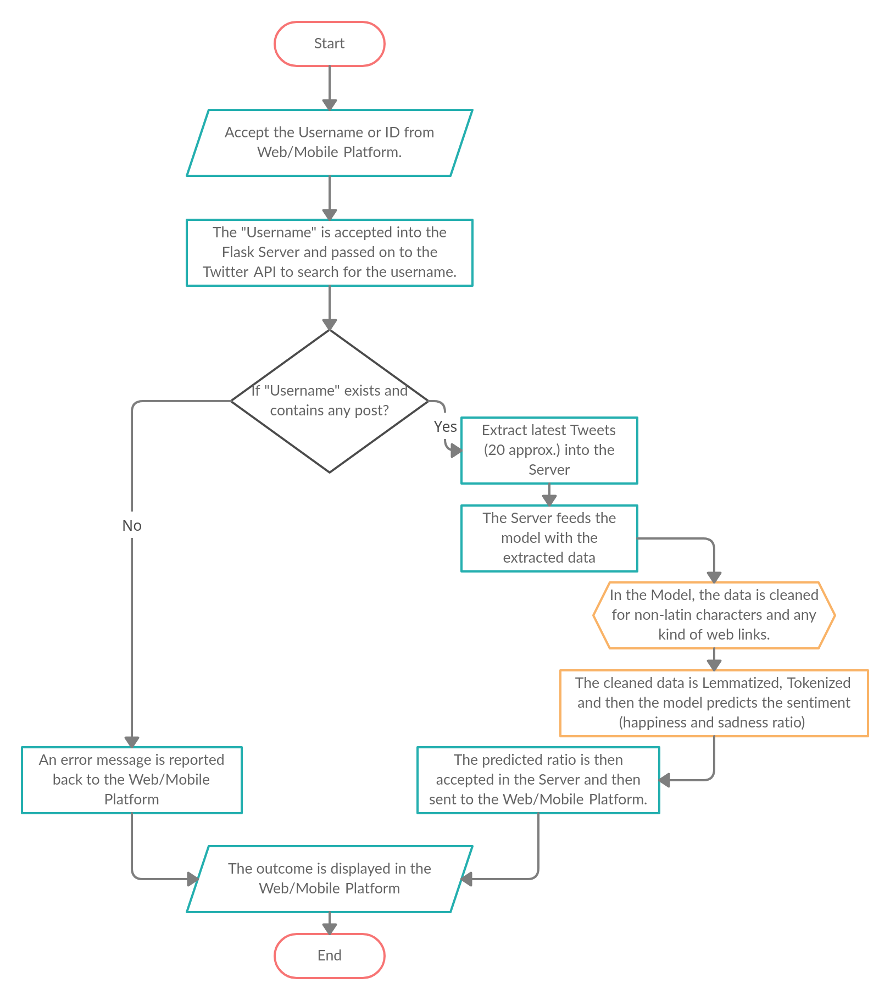

# Sentinum--Sentiment-Analysis-using-Social-Media-Data

## Introduction

In this project, we are using the Sentiment Analysing algorithm to predict the emotional state of an individual based on the data input from the person's social media posts and interactions. To perform this analysis, we use an interactive platform like the website or the mobile application and take the user authorized account name and process the data accordingly in our server and finally display the result of analysis performed i.e. the emotional state of the individual whose account name was provided. The main motive behind this project is to predict the mental health of a person during the lockdown period. When a person is locked-up in his home, he/she express his/her emotion through social media posts.

## Theoretical Approach

The problem is a very challenging one for us. But the basic approach we are devising is very simple. First, we will be asking the user to enter the username of his/her. We will then process the username and fetch the data from the Twitter database using the Tweepy API. Then we will pass the data through our pre-trained model to analyze the photo and determine the state of it. In this case, we will not be storing any kind of data. The below diagram will help it understand better

We will be using Heroku as our hosting server for API and backend activities. Our web platform will be running on an Heroku web server. Note:-For now we will only be using the Twitter database and not any other social media platform.The reason behind this is because Facebook and Instagram only provide data to verified organizations, due to their privacy policies.

## Techstack Used

- [**Machine Learning Model**](https://github.com/swapnanildutta/Sentinum--Sentiment-Analysis-using-Social-Media-Data/tree/ml-model-training)
  - NLTK Toolkit for Data processing and cleaning
  - Sentinum140 dataset
  - XGBoost Classifier
- [**Backend Serving API**](https://github.com/swapnanildutta/Sentinum--Sentiment-Analysis-using-Social-Media-Data/tree/backend-api)
  - Tweepy Package
  - Flask Framework with Python3 Language
-

## **References**

API:

- [https://medium.com/@aakashgoel12/my-first-simple-nlp-based-heroku-app-5-easy-steps-to-deploy-flask-application-on-heroku-bed53ebcbc6e](https://medium.com/@aakashgoel12/my-first-simple-nlp-based-heroku-app-5-easy-steps-to-deploy-flask-application-on-heroku-bed53ebcbc6e)
- [https://towardsdatascience.com/create-an-api-to-deploy-machine-learning-models-using-flask-and-heroku-67a011800c50](https://towardsdatascience.com/create-an-api-to-deploy-machine-learning-models-using-flask-and-heroku-67a011800c50)
- [http://docs.tweepy.org/en/v3.2.0/getting_started.html#introduction](http://docs.tweepy.org/en/v3.2.0/getting_started.html#introduction)

ML Model:

- [https://www.nltk.org/](https://www.nltk.org/)

Mobile Application:

- [https://flutter.dev/docs](https://flutter.dev/docs)

Web Application:

- [https://getbootstrap.com/docs/4.5/getting-started/introduction/](https://getbootstrap.com/docs/4.5/getting-started/introduction/)
- [https://www.w3schools.com/bootstrap/](https://www.w3schools.com/bootstrap/)
- [https://stackoverflow.com/questions/35410228/how-to-get-status-code-when-using-after-request](https://stackoverflow.com/questions/35410228/how-to-get-status-code-when-using-after-request)
- Flask Web Development: Developing Web Applications with Python- by Miguel Grinberg
